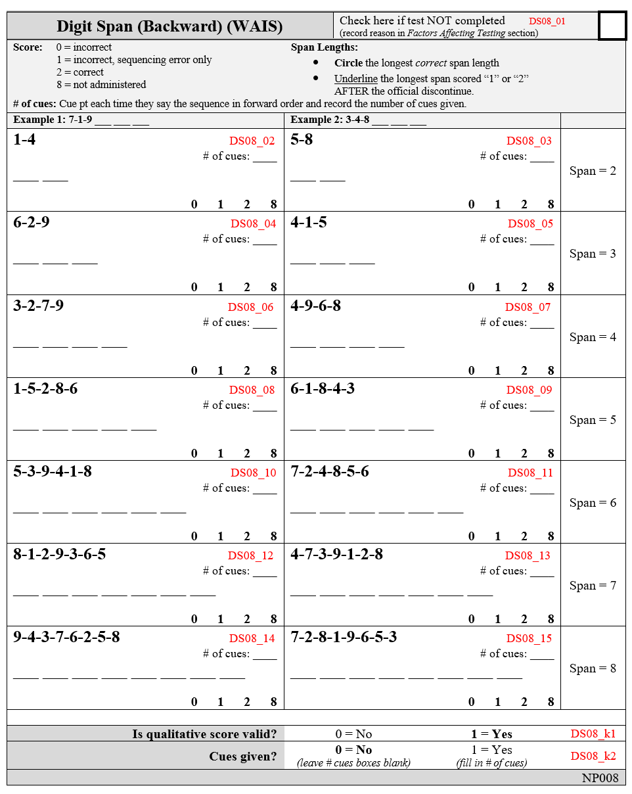
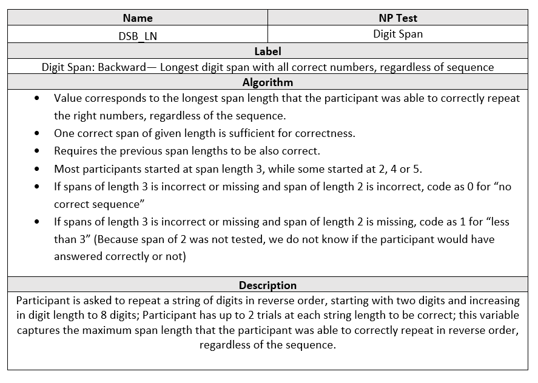
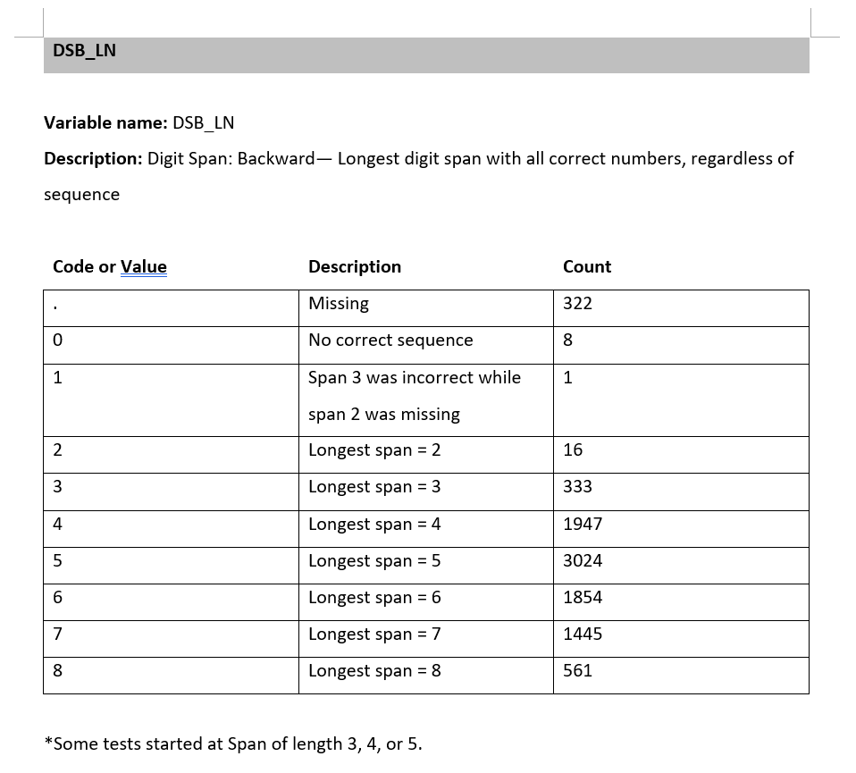
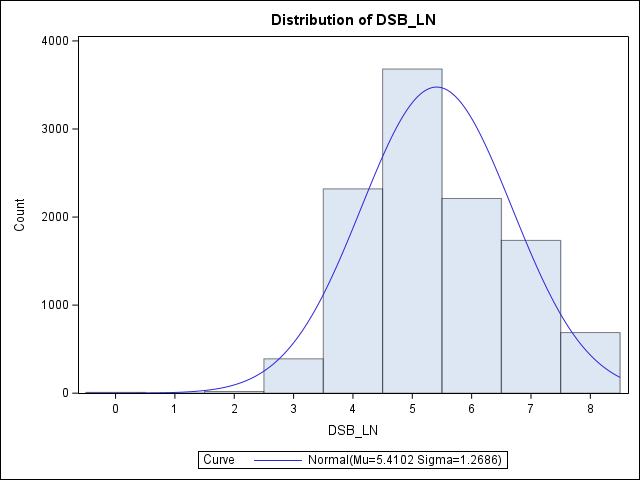
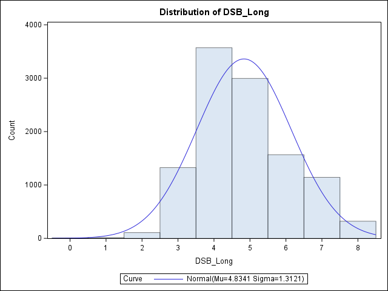

# 🧠 Boston Process Approach (BPA) Errors Data Curation 

Curated a comprehensive dataset of categorized errors made by the participants on Framingham Heart Study’s Neuropsychological Exams (following the BPA guidelines).  Collaborated with researchers to define error types, their derivation algorithms, as well as cleaning and curation steps to process raw datasets.  

---

## 📌 Objectives

- Curated a centralized dataset of BPA errors from raw neuropsychological assessments data
- Generate derived error variables suitable for statistical modeling
- Coded dynamic SAS program capable of updating the output dataset with new entries
- Documented the final dataset and the coding process through coding manual and programming protocol

---
## 🔧 Data Cleaning & Feature Engineering
---

## 🛠️ Tools Used

- **SAS 9.4**
  - `PROC SQL`, `DATA step`, `multi-dimensional ARRAY`, `MERGE`, `DO loops`, `functions`, `logical operators`
- Windows SAS environments
- Excel

---

## 🔢 Example Output Variable 

This section demonstrates a sample derived variable `DSB_LN` from the curated dataset, the step-by-step approach to its derivation and documentation, as well as a simple analysis using the derived variable. 

- ### Motivation

As part of the assessment, participants are asked to repeat backwards sequences of increasing length (See below). We are interested in tracking the longest span that was answered correctly OR only containing sequencing errors, in other words, the numbers were correctly repeated regardless of order.  We capture that value in the variable `DSB_LN`.

- ### Coding and Cleaning

The following code snippet creates the desired variable:

[👨‍💻 View Code Snippet](codes/CodeSnippet.sas)

The coding deals with unique challenges to creating this variable, such as missing values, skipped test, and inconsistent starting lengths at the discretion of the examiner.  Based on recommendation from a psychology specialist, the longest span would require all previous spans to be correct as well.

- ### Documentation

Descriptions, algorithms, and test categories of all variables are thoroughly documented in the Programming Protol.  The record for DSB_LN is shown here:

Additionally, each variable also has an accompanying Data Dictionary, giving the possible values or ranges these variables can take.  It also contains missing values and frequency counts for each variable.  For example, the entry for `DSB_LN` is:

Visualizing the distribution of `DSB_LN` via a histogram, we get:

Highlighting that the longest length with correct numbers are roughtly symmetric and centered around 5.

- ### Sample data analysis
-	- **Motivation**
   
Another variable `DSB_Long` captures the longest correct span, where the sequence must be correctly repeated backwards.  It has the following distribution:

We wish to test if there is a significant number of participants who made sequencing errors only on their incorrect span.

- 	- **Method**

This is a classic hypothesis testing problem, comparing whether the average `DSB_LN` value (μLN) is greater than the average `DSB_Long` value (μLong):

> **H₀: μLN = μLong** 
 
> **H₁: μLN > μLong**

I choose to use the paired t-test, as both variables are related, from the same participants, and are roughly symmetric. 

-  	- **Result**

The full output is [here](https://calving-analytics.github.io/Projects-Portfolio/BPA%20Error%20Data%20Curation/Output/TestOutput.html), while the table below summarizes the test result.

| μLN   | μLong   | μdiff    | Std Err | t-stat  | p-value |
|------|------|-------|---------|----|---------|
| 5.41 | 4.83 | 0.576 | 0.008   | 70 | <.0001  |

Because of the large t-statistic and small p-value, **H₀** is rejected.

-	- **Conclusion**

We can soundly conclude that there is a significant number of participants making sequencing error in their first incorrect response.  Highlighting that the numbers are encoded in memory more strongly than their sequence. 

---

## 🔗 Related links

- [🌐FHS-BAP Errors Data Webpage with Coding Manual](https://fhsbap.bu.edu/docs_main/qualitative_errors_in_neuropsychological_exams)
- [💻Programming Protocol](https://www.bu.edu/fhs/share/protocols/vr_npqerror_2021_a_1468s_protocol1.pdf)
- 🎓Published Articles
	- [Gurnani et al., 2023](https://doi.org/10.1093/arclin/acad067.009)
	- [Ferretti et al., 2024](https://doi.org/10.1002/alz.13500)
