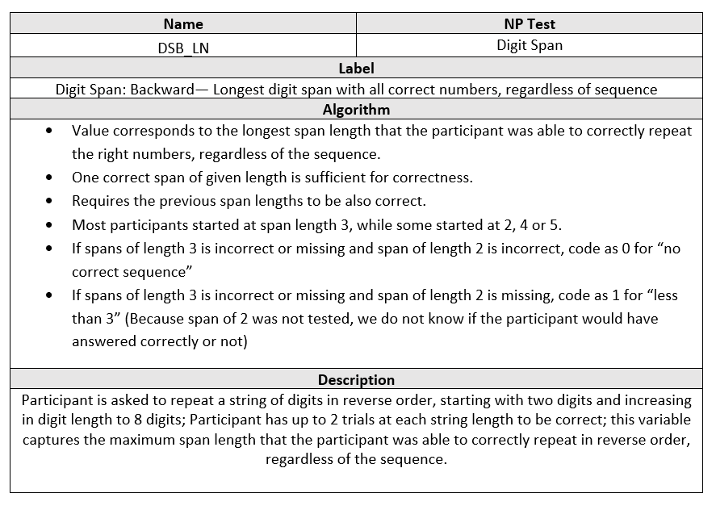
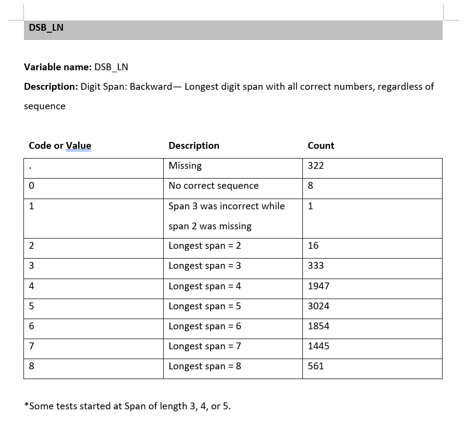

# 🧠 Boston Process Approach (BPA) Errors Data Curation

Curated a comprehensive dataset of categorized errors made by the participants on Framingham Heart Study’s Neuropsychological Exams (following the BPA guidelines).  Collaborated with researchers to define error types, their derivation algorithms, as well as cleaning and curation steps to process raw datasets.  

---

## 📌 Objectives

- Curated a centralized dataset of BPA errors from raw neuropsychological assessments data
- Generate derived error variables suitable for statistical modeling
- Coded dynamic SAS program capable of updating the output dataset with new entries
- Documented the final dataset and the coding process through coding manual and programming protocol

---

## 🛠️ Tools Used

- **SAS 9.4**
  - `PROC SQL`, `DATA step`, `multi-dimensional ARRAY`, `MERGE`, `DO loops`, `functions`, `logical operators`
- Windows SAS environments
- Excel
  
---

## 🔧 Data Curation Process

- ### Introduction & Inputs

Participants in the Framingham Heart Study Brain Aging Program (FHS-BAP) undergo periodic neuropsychological assessments throughout the study.  The assessment consist of a variety of mental activities across 20 test sections.  Raw data from each activity are collected and stored in SAS datasets.  This data curation project aggregates these raw data to create a centralized dataset of BPA errors.  The process involves thorough discussion with psychologists to determine professional definitions, categorization, and derivation of the error variables.

- ### Data Cleaning & Feature Engineering

**Data Cleaning**

Data cleaning is an essential process in this project, to ensure accuracy and consistency.  Missing values are prevalent in the raw data, reasons for missing include omission by the participant, skipped over by the tester, or unknown/ineligible.  Curated features from input variables need to carefully consider missing values and their impact on the outcome.  For example, a binary variable where `YES` indicate a correct response would be coded as `NO` if the response is omitted but `missing` if it is unknown.

Furthermore, various differences between individual tests must be harmonized.  These differences could include forms (long, short, remote), versions, question sets, and examiner discretion in skipping over certain questions. Form differences are taken into account via a dummy variable, allowing researchers the option to exclude exams fitting a certain form type.  Other types of differences are coded into derivation algorithms appropriately. 

**Feature Engineering**

Error features consist of two types: original and derived.  Original variables are essentially copies of existing entries on the assessment form, except for missing values which are re-coded based on their missing type (Blank, Omitted, Unknown).  Derived variables are error measures derived from multiple entries.  Derivations could be simple like a sum of entries or complex with special considerations (see `DSB_LN` example in the Example Output Variable section).  For most of the derived variables, we need to consider missing values and dependencies on other related variables.  For example, the inputs of derivation algorithm are dependent on the question sets given.  The features are derived via SAS `data` steps, through extensive use of `array` syntax, `DO` loops, and logical operators.

- ### Summary & Outputs

The output is a single centralized dataset of over 140 BPA error variables across 20 test sections.  It contains the records for over 9000 exams from over 5000 participants.  The dataset is currently available on the [FHS-BAP website](https://fhsbap.bu.edu/docs_main/qualitative_errors_in_neuropsychological_exams), multiple articles have been published using the dataset (see links).

Additionally, the curation process have been thoroughly documented via programming protocol and data dictionary.  The programming protocol contains the derivation formulas for all error variables as well as important usage notes.  The data dictionary contains the possible values or ranges for all variables, along with missing values and frequency counts for each variable.

---

## 🔢 Example Output Variable

This section demonstrates a sample derived variable `DSB_LN` from the curated dataset, the step-by-step approach to its derivation and documentation, as well as a simple analysis using the derived variable.

- ### Motivation

As part of the assessment, participants are asked to repeat backwards sequences of increasing length (See below). We are interested in tracking the longest span that was answered correctly OR only containing sequencing errors, in other words, the numbers were correctly repeated regardless of order.  We capture that value in the variable `DSB_LN`.

- ### Coding and Cleaning

The following code snippet creates the desired variable:

[👨‍💻 View Code Snippet](codes/CodeSnippet.sas)

The coding deals with unique challenges to creating this variable, such as missing values, skipped test, and inconsistent starting lengths at the discretion of the examiner.  Based on recommendation from a psychology specialist, the longest span would require all previous spans to be correct as well.

- ### Documentation

Descriptions, algorithms, and test categories of all variables are thoroughly documented in the Programming Protocol.  The record for DSB_LN is shown here:

Additionally, each variable also has an accompanying Data Dictionary, giving the possible values or ranges these variables can take.  It also contains missing values and frequency counts for each variable.  For example, the entry for `DSB_LN` is:

Visualizing the distribution of `DSB_LN` via a histogram, we get:

Highlighting that the longest length with correct numbers are roughly symmetric and centered around 5.

- ### Sample data analysis

- - **Motivation**

Another variable `DSB_Long` captures the longest correct span, where the sequence must be correctly repeated backwards.  It has the following distribution:

We wish to test if there is a significant number of participants who made sequencing errors only on their incorrect span.

-  - **Method**

This is a classic hypothesis testing problem, comparing whether the average `DSB_LN` value (μLN) is greater than the average `DSB_Long` value (μLong):

> **H₀: μLN = μLong**

> **H₁: μLN > μLong**

I choose to use the paired t-test, as both variables are related, from the same participants, and are roughly symmetric.

-   - **Result**

The full output is [here](https://calving-analytics.github.io/Projects-Portfolio/BPA%20Error%20Data%20Curation/Output/TestOutput.html), while the table below summarizes the test result.

| μLN   | μLong   | μdiff    | Std Err | t-stat  | p-value |
|------|------|-------|---------|----|---------|
| 5.41 | 4.83 | 0.576 | 0.008   | 70 | <.0001  |

Because of the large t-statistic and small p-value, **H₀** is rejected.

-	- **Conclusion**

We can soundly conclude that there is a significant number of participants making sequencing error in their first incorrect response.  Highlighting that the numbers are encoded in memory more strongly than their sequence.

---

## 🔗 Related links

- [🌐FHS-BAP Errors Data Webpage with Coding Manual](https://fhsbap.bu.edu/docs_main/qualitative_errors_in_neuropsychological_exams)
- [💻Programming Protocol](https://www.bu.edu/fhs/share/protocols/vr_npqerror_2021_a_1468s_protocol1.pdf)
- 🎓Published Articles
 - [Gurnani et al., 2023](https://doi.org/10.1093/arclin/acad067.009)
 - [Ferretti et al., 2024](https://doi.org/10.1002/alz.13500)
