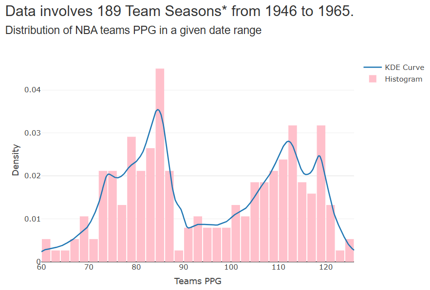

# 🕵🏽‍♀️ Estimating Distribution of Points Scored in the NBA via Bayesian and Kernel Methods.

## 📃 Table of Contents

- [🕵🏽‍♀️ Estimating Distribution of Points Scored in the NBA via Bayesian and Kernel Methods.](#️-estimating-distribution-of-points-scored-in-the-nba-via-bayesian-and-kernel-methods)
  - [📃 Table of Contents](#-table-of-contents)
  - [🚀 Overview](#-overview)
  - [💻 Data](#-data)
  - [📑 Methods](#-methods)
  - [📊 Results \& Visualizations](#-results--visualizations)
  - [💬 Discussion](#-discussion)
    - [Future Work](#future-work)
  - [🔧 Tools](#-tools)
  - [🔗 Links](#-links)
  - [📚 References](#-references)

## 🚀 Overview

This class project is originally the final project of my graduate course (MA578: Bayesian Statistics) at Boston University.  My goal was to model complex distributions of NBA points scored using Bayesian and Kernel methods, followed by an assessment of the results.  I have since then updated my work by creating a Shiny dashboard that allows flexibility in choosing hyperparameters and timeframes, resulting in a clearer picture of the results.

## 💻 Data

This analytics project uses publicly available NBA dataset `team_season.txt` containing season-level team performances from the league's inception to 2004 from the website https://www.basketball-reference.com/.  Each row represents a team in a specific season, and their key information such as wins, points scored, rebounds, and other metrics.  The focus of this project is on the **Points Per Game (PPG)** metric, calculated as the total points scored in the season `o_pts` divided by the number of games played `won + lost`.

## 📑 Methods

My main objective is estimating the distribution of **PPG** of each team in each season for a given timeframe.  Traditional parametric methods for the estimation requires making assumptions on the shape of the distribution, which may not hold in practice.  For example, assuming a Gaussian distribution would not hold when examining the first 2 NBA decades `1946 - 1965` (**Figure 1**), as the distribution is clearly bimodal.

**Figure 1.** Histogram of **PPG** from 1946 - 1965. [^1]

[^1]: Screenshot is from my custom [Shiny Dashboard](https://catalyzeanalytics.shinyapps.io/Bayesian-KDE-ab-Slider/) made for this project, you can change the parameters and watch the output change.

Instead, I used a nonparametric density estimation, which fits a smooth curve based solely on the data.  My method of choice is the well-known Kernel Density Estimation (KDE), which fits a Kernel function using the data within a neighborhood of $x$.

That is, we estimate $f(x)$, the true distribution of $x$ with:

$$
\hat{f}(x | h, \vec{X}) = \frac{1}{n h} \sum_{i=1}^{n} K\left( \frac{x - X_i}{h} \right)^2
$$

Where $\vec{X} = (X_1, X_2, \dots, X_n)$

The KDE method is heavily influenced by the choice of the bandwidth $h$: too large and the estimate misses important features and creates bias, yet if it's too small the curve overfits to the noise and makes a poor estimate.  Many authors in literature have contrived methods for selecting an appropriate $h$, this project follows a Bayesian approach as described in (Gangopadhyay, 2002)[[I]](#ref1). 

The Bayesian approach uses Bayes' Rule to construct a posterior distribution based on a prior distribution and the likelihood function of observed data.

**The Bayes Rule**

$P(A|B) = \frac{P(B|A)  P(A)}{P(B)}$

**Posterior Distribution Formula**

$\pi(h|x,\vec{X}) = \frac{L(\vec{X} | h, x)  \pi(h)}{\int{L(\vec{X} | h, x ) \pi(h) dh}}$

If we use a **Gaussian Kernel** in the KDE

$K(u) = \frac{1}{\sqrt{2\pi}} \exp({\frac{-u^2}{2}})$

The resulting KDE resembles a Gaussian likelihood centered at $x$:

$$
\hat{f}(x | h, \vec{X}) = L(\vec{X} | h, x) = \frac{1}{\sqrt{2\pi} n h} \sum_{i=1}^{n} \exp\left( -\frac{1}{2} \left( \frac{x - X_i}{h} \right)^2 \right)
$$
The bandwidth $h$ acts as the standard deviation parameter of a Gaussian distribution, therefore it has the Inverse-Gamma conjugate prior: $\pi(h) \sim IG(\alpha, \beta)$.  As such, the estimated posterior distribution of $h$ has a closed-form solution:
$$
\hat{\pi}(h \mid x, \vec{X}) =
\frac{
\sum_{l=1}^n ( \frac{1}{h^{2\alpha+2}} ) \exp \{ -\frac{1}{h^2} ( \frac{(X_i - x)^2}{2} + \frac{1}{\beta} ) \}
}{
\sum_{l=1}^n ( \frac{\Gamma(\alpha + 1/2)}{2} )
( \frac{(X_i - x)^2}{2} + \frac{1}{\beta} )^{-\alpha - 1/2}
}
$$

Hence. the best bandwidth $h^*$ is the posterior mean:

$$
h^*(x) = E[h \mid x, \vec{X}]= \frac{\Gamma(\alpha)}{\sqrt{2 \beta} \Gamma(\alpha+1 / 2)} \frac{\sum_{i=1}^n[1 /(\beta(X_i-x)^2+2)]^\alpha}{\sum_{i=1}^n[1 /(\beta(X_i-x)^2+2)]^{\alpha+1 / 2}}
$$

The derivation steps are written out in (Gangopadhyay, 2002)[[I]](#ref1).

$h^*$ is a function of the data vector $\vec{X}$, the evaluation point $x$, and the prior hyperparameters $\alpha, \beta$.  Note it is unnecessary to optimize $\alpha, \beta$ as the method outperforms traditional bandwidth selection methods as long as the hyperparameters are reasonable [[I]](#ref1).  Reasonable hyperparameters are ones that produces bandwidths that are neither too narrow or wide, to avoid high bias and variance.  Nevertheless, a potential optimization method is proposed in the Discussion section.

## 📊 Results & Visualizations

I created an interactive [Shiny Dashboard](https://catalyzeanalytics.shinyapps.io/Bayesian-KDE-ab-Slider/) that implements the Bayesian KDE method on the NBA **PPG** data, allowing for inputs of $\alpha, \beta$, and date range.  The dashboard clearly shows the effects of $\alpha, \beta$ on the bandwidth and KDE curve.   $h^*$ tends to decrease as either $\alpha \text{ or } \beta$ increases, but each parameter has a distinct effect on the KDE curve.  

$\alpha$ controls the height of the curve: a tiny $\alpha$ gives a flat curve that is mostly unaffected by the data, and increasing it allows the shape to vary in height and fits closely to the histogram (**Figure 2**).

**Figure 2**. KDE curves for $\alpha = .1$ (left) and $\alpha = 5$ (right), in each case $\beta = .1$

  
  

Meanwhile, $\beta$ determines the smoothness of the curve, a tiny $\beta$ produces a very smooth curve, and increasing it will make the curve more rough and jagged (**Figure 3**).

**Figure 3**. KDE curves for $\beta = .1$ (left) and $\beta = 3$ (right), in each case $\alpha = 2$

  
  

Recall that to pick a good fitting curve, it cannot be too flat nor too jagged.  As a flat curve would create bias and miss the true distribution, while a jagged curve overfits to the noise and make a poor estimator for new data.  I used the interactive dashboard to pick what appears to be a good fit, using $\alpha = 1.2 \text{ and } \beta = .4$ (**Figure 4**).

**Figure 4**. A well-fit curve, $\alpha = 1.2 \text{ and } \beta = .4$

  

Note that any reasonable $\alpha\text{ and }\beta$ can produce a well-fit curve, choosing them is trivial thanks to the power of the Shiny interactive app.  This density estimation approach fully captures the bimodal nature of the data.

## 💬 Discussion

### Future Work

While the Bayesian KDE approach performs well without the need to optimize, one may nonetheless wish to come up with an optimization method.  One convenient measure to judge the performance of a density estimator is the Mean Integrated Squared Error (MISE):

$$
\text{MISE}(\alpha, \beta)=\mathbb{E}\left[\int\left(\hat{f}_{\alpha, \beta}(x)-f(x)\right)^2 d x\right]
$$

which is the equivalent to a function of the bias and variance, thus naturally taking account of the bias-variance trade-off[[II]](#ref2):

<!-- $$
\text{MISE}(\alpha, \beta) = \int \left[ \text{Bias}^2(\hat{f}_{\alpha, \beta}(x)) + \text{Var}(\hat{f}_{\alpha, \beta}(x)) \right] dx
$$ -->

While the underlying distribution $f(x)$ is always unknown in real data, it can be estimated using a cross-validation approach such as the Least-Squares Cross-Validation (LSCV):

<!-- $$
\text{LSCV}(\alpha, \beta)=\int \hat{f}_{\alpha, \beta}^2(x) d x-\frac{2}{n} \sum_{i=1}^n \hat{f}_{-i}(X_i)
$$ -->

<!-- $$
\text{LSCV}(\alpha, \beta)=\int \hat{f}_{\alpha, \beta}^2(x) d x-\frac{2}{n} \sum_{i=1}^n \hat{f}_{\alpha, \beta,-i}\left(X_i\right)
$$ -->

Therefore, minimizing LSCV over a grid of $\alpha \text{ and } \beta$ values will result in the optimizers $ a^*, 

$$
\beta^*
$$

## 🔧 Tools

## 🔗 Links
- [Shiny Dashboard: Bayesian KDE Curve on NBA **PPG** Data](https://catalyzeanalytics.shinyapps.io/Bayesian-KDE-ab-Slider/)

- [Original Class Project Report](BayesianBandwidthPaper.pdf)

  - The original report that captures the core idea without the interactive dashboard.  Instead I drew a density ridge plot over time to show how the **PPG** distribution evolves over time.  It also include analyses on the distribution of Field Goal Percentage (**FG%**) and Free Throw Percentage (**FT%**).
     

## 📚 References

[I] [Gangopadhyay, A., & Cheung, K. (2002). Bayesian approach to the choice of smoothing parameter in kernel density estimation. *Journal of nonparametric statistics*, 14(6), 655-664.](https://www.tandfonline.com/doi/abs/10.1080/10485250215320)

[II] [Wasserman, Larry. Lecture Notes for Statistics 240: Nonparametric Statistics. University of California, Berkeley, n.d.](https://www.stat.berkeley.edu/~csun/stat240/)
